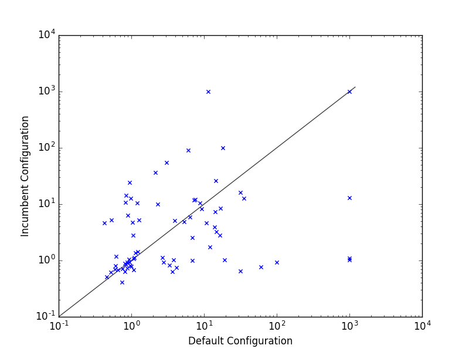
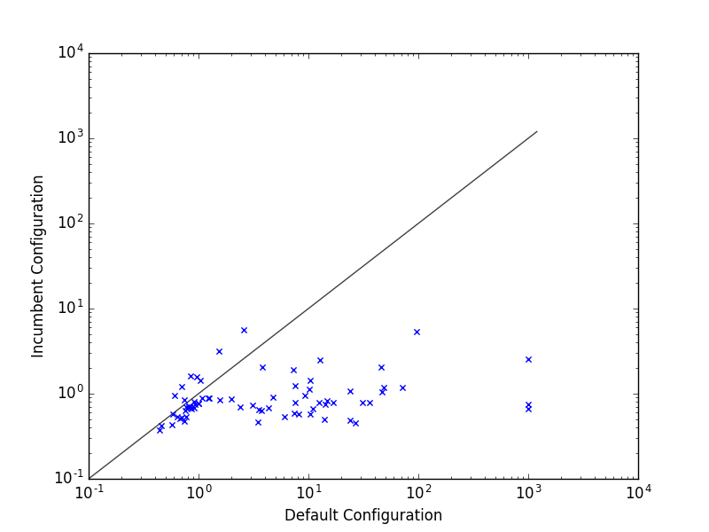

# README for exercise 3

## Setting up requirements

* SMAC and all its dependencies
* GenericWrapper4AC and its depencencies
* lpg and its requirements

Also needed (for plotting results): 

```
$ pip install matplotlib
$ sudo apt-get install python3-tk
```

## Running configurator
Run 

```
$ python3 lpg-configuration.py
```

in the folder lpg-depots.

## Results

The results of four independent runs on the cluster are listet in the result folder.






