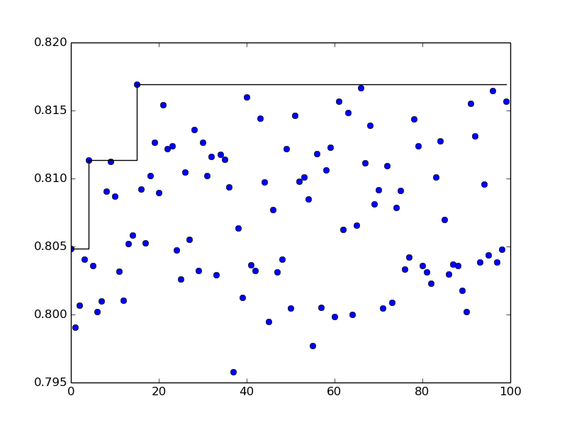
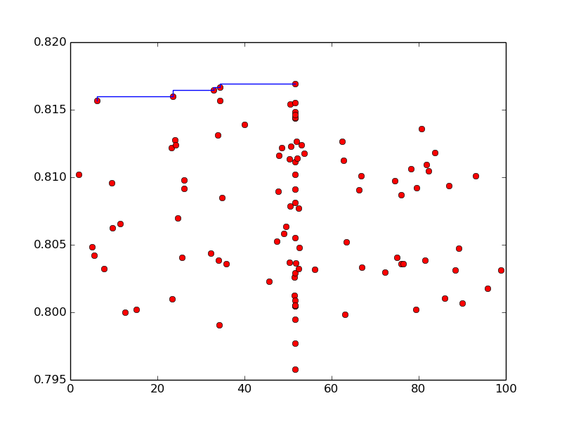

# Exercise 02.4 :: AC Benchmanrk
This part of the project is designed to run SMAC on a cluster to get
an algorithm configuration benchmark.

## Installation
First of all, install Python3.6 and its dev files:
```bash
$ sudo add-apt-repository ppa:deadsnakes/ppa
$ sudo apt-get update
$ sudo apt-get install python3.6
$ sudo apt-get install python3.6-dev
$ sudo apt-get install python3.6-tk
```

Install `swig3.0`:
```bash
$ sudo apt-get remove swig
$ sudo apt-get install swig3.0
$ sudo ln -s /usr/bin/swig3.0 /usr/bin/swig
```

Create a virtualenv:
```bash
$ virtualenv -p python3.6 venv
$ source venv/bin/activate
```

Install required packages:
```bash
$ pip install Cython
$ pip install pyrfr==0.8.0 --no-cache
$ pip install numpy scipy sklearn matplotlib
$ pip install git+https://github.com/openml/openml-python.git
```

Install SMAC3 from my own repository to avoid the bug with `pyrfr`:
```bash
$ pip install git+https://github.com/angellandros/SMAC3.git@development
```

## Usage
You need to get the submodule from the remote Github 
repository to be able to run the code.
```bash
$ git submodule init
$ git submodule update
```

To run the code on a cluster use the `schedule.sh` file:
```bash
$ qsub schedule.sh
```

## Benchmark
In random search for hyperparameter optimization it is handy to use a non-uniform distribution.
The project residing [here](https://github.com/angellandro/mllab) makes use of
multivariate kernel density estimators to do so. One of the parameters in this approach is named
cutoff, which we are interested to tune here.

In another experiment, only checking multipliers of 5, the
cutoff of 20 achieved the best mean performance of 0.8164.

## Results
Having 100 SMAC runs, we can generate the following figure showing performance over iterations:

 

The next figure shows tested points against their performances:



Top 5 performances belongs to the points:
1. 51.5796654333
2. 34.3223552732
3. 32.9461092786
4. 23.5710780914
5. 6.11206204953

Their accuracy scores being:
1. 0.816925546869
2. 0.816686074156
3. 0.816432670213
4. 0.815976643565
5. 0.815703033157