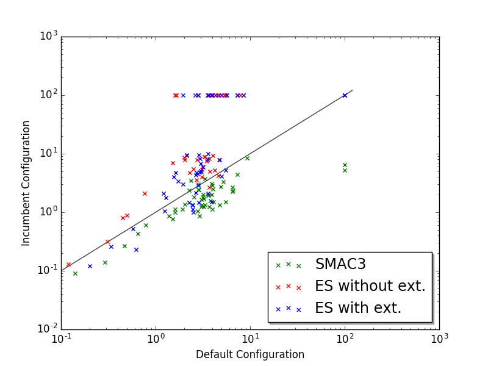
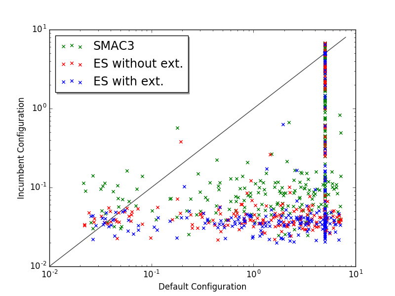
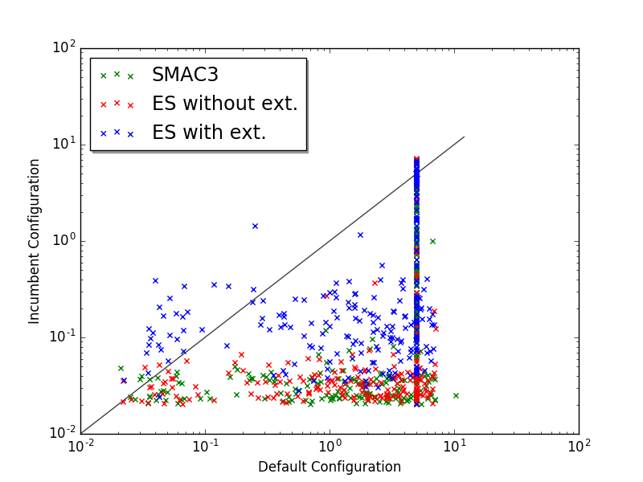
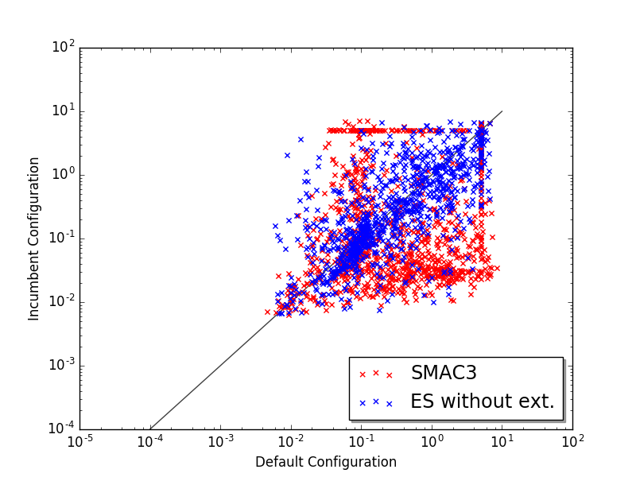

# README for our ES optimizer

## Setting up requirements
Our tool doesn't require any other packages than what is already needed for ACLIB or SMAC3. For running our tool out of ACLIB you need to install

* *ACLIB* and all it dependencies

Also needed (for plotting results): 

```
$ pip install matplotlib
$ sudo apt-get install python3-tk
```

## Running configurator

All files for the configurator can be found in the folder "es-optimizer".
Run 

```
$ python3 es --scenario_file <scenario.txt> [--X <int>] [--M <int>] [--A <int>] [--initial_pop <int>] [--extension <True/False>] [--seed <int>] [--verbose_level <INFO/DEBUG>]
```
* where *X* (default 10) is the percentage of how many population members from the competitive population are chosen for mating,
* where *M* (default 10) is the percentage of with which probability a variable is mutated when mating,
* where *A* (default 3) is the maximal age a population member can have before being killed,
* where *initial_pop* (default 20) is the amount of initial population members that are randomly assigned to competitive and non-competitive
* where *extension* (default False) is the switch for turning on sexual selection or using default selection.

## Running configurator out of ACLIB

To add our configurator to aclib, we followed the steps provided by aclib. The configurators es and esext (with extension) are added as an option to the argument parser of the run.py and validate.py scripts, and also to the configurators. The edited files and new configurator folders can be found in the aclib-files directory and just need to be added to ACLIB to replace the original ones.
After that, our configurator can be called as:
```
 $ python3 aclib/run.py -s branin -c ES
 $ python3 aclib/run.py -s branin -c ESEXT
```

## Results

The results for the three benchmarks can be found in the results folder.

### GUROBI as our own benchmark
As our own benchmark we used GUROBI, a MIP solver as the target algorithm on the BCOL-CLS instances. Unfortunately the time was too short to ask for a license to run our benchmark on the cluster, we only had an academic single machine license. Since the wrapper we used was 2 years old, it seemed that it was not possible to add the benchmark to ACLIB so we had to run SMAC3 and ES from separated script.

The scenario file and the script for running SMAC3 and our own tool on the solver can be found in the folder gurobi-benchmark. 
An instruction on how to set up GUROBI can be found here: http://www.gurobi.com/documentation/ .

Results of some runs:




### satenstein
The plots generated by ACLIB had some faults, as the performance curve for SMAC3 and our tool have some upwards steps which is not possible. Unfortunately we did not have enough time to figure out, what the problem was, that these faulty plots were generated. But we generated scatter plots of the test instances for the first four runs to show, that this was only a problem of plotting and not of our tool (or SMAC3). We used the ObjectiveMatrix, generated by ACLIB, found in the validate-time-test folder that is created by aclib. Both tools optimized the satenstein scenario, as can be seen in the scatter plots.




### spear
Unfortunately, we did not manage to get proper results for the spear benchmark. Not only were the plots generated by ACLIB very wrong, but also the scatter plot showed bad results with no optimization factor. We assume that SMAC3 is able to optimize this benchmark within the given wallclock-limit given in the scenario. Since our plots show differently, we assume that something must have gone wrong when executing SMAC3 and our tool. Unfortunately we did not have enough time to test, whether it was a problem of executing the configurators or something else.


